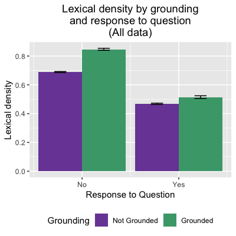
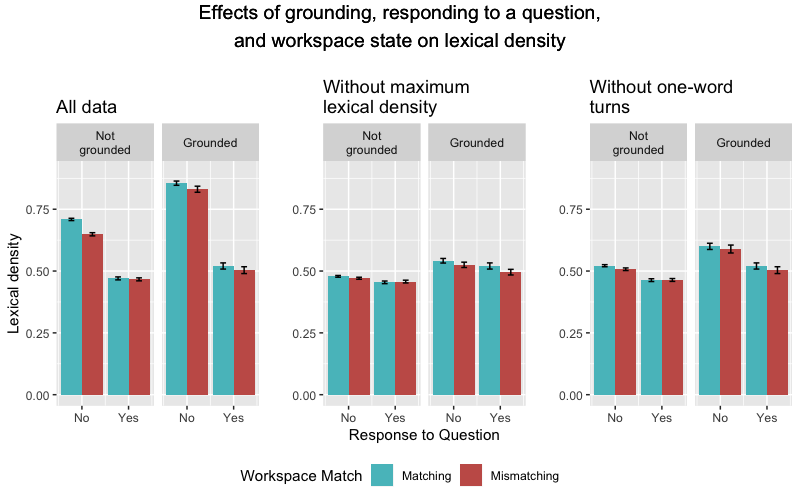
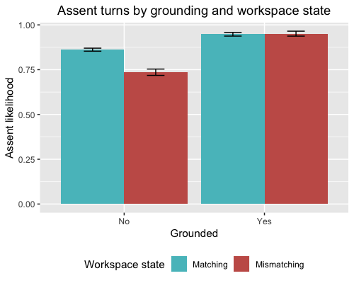

This R markdown provides the basis for our manuscript, "Communication breakdown prompts readjustment of informativeness" (Roche\*, Paxton\*, Ibarra, & Tanenhaus, in preparation). The study explores how miscommunication relates to lexical complexity, spatial referents, grounding, and requests for repair.

To run these analyses from scratch, you will need the following files:

* `./data/bloco_corpus_file-2017_03_28.csv`: Contains experimental data.
* `./code/libraries_and_functions-MJA.r`: Loads in necessary libraries and creates new functions for our analyses.
* `./dictionaries/spatial_word_list-MJA.csv`: List of spatial words.
* `./dictionaries/ntlk_stopwords_list-MJA.csv`: List of stopwords, expanded for completeness from Python's NLTK English stopwords list (see `transcription_protocol-MJA.md` for complete details).
* `./dictionaries/assent_negation_dictionary-MJA.csv`: Dictionary of assent and negation words.

Additional files will be created during the initial run that will help reduce processing time. Several of these files are available as CSVs from the OSF repository listed above.

**Written by**: A. Paxton (University of Connecticut) and J. Roche (Kent State University)

**Date last modified**: 19 May 2017

***

# Corpus preparation

***

## Preliminaries

This section reads in our raw data, provided in long format (i.e., 1 turn per line). Note that our unit of analysis is the turn, which is one talker's single and complete utterance.


```r
# clear our workspace
rm(list=ls())

# read in libraries and create functions
source('./code/libraries_and_functions-MJA.r')

# read in dataframe
bloco = read.csv('./data/bloco_corpus_file-2017_03_31.csv',sep=',',
                 stringsAsFactors=FALSE, header = TRUE)
```

***

## Prepare dictionaries

Here, we read in the dictionaries that will help us categorize spatial words, assent words, negation words, and stopwords.


```r
# read in relevant dictionaries
ntlk_stopwords = rapply(unname(as.list(read.csv('./dictionaries/nltk_stopwords_list-MJA.csv',
                                                header=TRUE))), as.character)
spatial_terms = rapply(unname(as.list(read.csv('./dictionaries/spatial_word_list-MJA.csv',
                                               header=TRUE))), as.character)
assent_neg_table = read.csv('./dictionaries/assent_negation_dictionary-MJA.csv',
                            header=TRUE, stringsAsFactors=FALSE)

# separate assent and negation
negation_terms = dplyr::filter(assent_neg_table,type=='negation')$word
assent_terms = dplyr::filter(assent_neg_table,type=='assent')$word

# prep stopword list (excluding spatial, assent, and negation) and make it regex-friendly
ntlk_stopwords = ntlk_stopwords[!ntlk_stopwords %in%
                                  c(spatial_terms,assent_terms,negation_terms)]
ntlk_stopwords = paste0('\\b', ntlk_stopwords, '\\b')
```


***

## Clean transcript and derive turn-based language metrics

First, we convert all text to lowercase and strip out punctuation and stopwords. Next, we capture information about the language on each turn:

* `question_mark_count`: Count of question marks per turn.
* `total_word_count`: Count of total words per turn (i.e., including stopwords).
* `character_count`: Count of characters in each turn (i.e., including stopwords, excluding spaces, excluding punctuations).
* `content_word_count`: Count of content words per turn (i.e., excluding stopwords).
* `spatial_words`: List of all spatial words per each turn (determined by `spatial_terms` list).
* `spatial_word_count`: Count of spatial words in each turn.
* `assent_words`: List of all assent words per each turn (determined by `assent_terms` list).
* `assent_word_count`: Count of assent words in each turn.
* `negation_words`: List of all negation words per each turn (determined by `negation_terms` list).
* `negation_word_count`: Count of negation words in each turn.
* `cleaned_transcript`: Transcription of each turn, excluding stopwords and punctuation.
* `unique_words`: List of unique words per turn, excluding stopwords.
* `unique_word_count`: Count of unique words per turn, excluding stopwords.


```r
# clean up the transcript
bloco = bloco %>% 
  
  # count number of question marks per turn
  mutate(question_mark_count = lapply(Transcript,
                                      function(x) 
                                        (sum(unlist(gregexpr("\\?", x))>0)))) %>%
  
  # convert to lowercase, strip punctuation, remove multiple spaces, get total word count
  mutate(cleaned_transcript = gsub("([[:punct:]])", " ", tolower(Transcript))) %>%
  mutate(cleaned_transcript = gsub(' +',' ',cleaned_transcript)) %>%
  mutate(total_word_count = wc(cleaned_transcript)) %>%
  
  # count character length of turns
  mutate(character_count = nchar(gsub(' ','',cleaned_transcript))) %>%
  
  # separate words, remove stopwords, and count content words
  mutate(unique_words = strsplit(cleaned_transcript,' ')) %>%
  mutate(cleaned_transcript = qdap::mgsub(ntlk_stopwords, ' ', 
                                          cleaned_transcript, fixed=FALSE)) %>%
  mutate(content_word_count = wc(cleaned_transcript)) %>%
  
  # identify and count spatial terms per turn
  mutate(spatial_words = lapply(unique_words,
                                function(x) (x[!is.na(match(x,spatial_terms))]))) %>%
  mutate(spatial_word_count = lapply(spatial_words,length)) %>%
  
  # identify and count assent words per turn
  mutate(assent_words = lapply(unique_words,
                               function(x) (x[!is.na(match(x,assent_terms))]))) %>%
  mutate(assent_word_count = lapply(assent_words,length)) %>%
  
  # identify and count negation words per turn
  mutate(negation_words = lapply(unique_words,
                                 function(x) (x[!is.na(match(x,negation_terms))]))) %>%
  mutate(negation_word_count = lapply(negation_words,length)) %>%  
  
  # identify and count unique words per turn
  mutate(unique_words = lapply(unique_words,unique)) %>%
  mutate(unique_word_count = as.integer(lapply(unique_words,length))) %>% 
  
  # replace NAs with 0
  mutate_at(vars(unique_word_count,
                 total_word_count,
                 spatial_word_count,
                 assent_word_count,
                 negation_word_count), 
            function(x) (replace(x,NA,0))) %>%
  
  # rename matching/mismatching variable
  dplyr::rename(mismatch_state = lCong)
```

***

## Export prepared corpus file


```r
data.table::fwrite(bloco,'./data/prepped_corpus-MJA.csv', 
       append=FALSE, sep=",", col.names=TRUE, row.names=FALSE)
```

***

# Data preparation

*** 

## Preliminiaries


```r
# clear our workspace
rm(list=ls())

# read in libraries and create functions
source('./code/libraries_and_functions-MJA.r')

# read in dataframe and expand embedded list variables
bloco_raw = data.table::fread('./data/prepped_corpus-MJA.csv',sep=',',header = TRUE)
bloco_raw = bloco_raw %>%
  mutate_at(vars(unique_words,
                 spatial_words, 
                 assent_words, 
                 negation_words), 
            funs(lapply(., function(x) (unlist(strsplit(x,"\\|"))))))
```

***

## Create turn-based lexical density

Here we calculate our turn-based measure of lexical complexity: `lexical_density` (using Johansson's (2009) definition).


```r
# convert turn to proportion of total turns
bloco_raw = bloco_raw %>% ungroup() %>%
  group_by(Pair) %>%
  mutate(comp_turn = row_number()) %>%
  group_by(Pair) %>%
  mutate(quantile_turn = ntile(comp_turn, 10))
  
# calculate proportions of complexity to total words for each turn, then replace any NAs with 0
bloco_raw = bloco_raw %>%
  mutate(lexical_density = content_word_count / total_word_count) %>%
  mutate_at(vars(dplyr::contains("lexical"), dplyr::contains("count")), 
            funs(lapply(., function(x) as.numeric(ifelse(is.na(x),0,x))))) %>%
  mutate_at(vars(dplyr::contains("lexical"), dplyr::contains("count")), 
            as.numeric)
```

***

## Refactor and create interaction terms

This section centers factor variables, creates interaction terms, and drops irrelevant columns.

We also convert `Grounded` to a binary variable, indicating whether an offer of grounding was accepted in that turn.  (We have very few [`n = 5`] turns in which 2 instances of offered grounding attempts were accepted, but we are interested simply in whether gounding occurred within a turn.)


```r
# identify which variables should be transformed to factors
factor_variables = c('Animal','mismatch_state','Phase','Pair','Talker','Grounded','question_used')

# create interaction terms
bloco_raw = bloco_raw %>% ungroup() %>%
  
  # center two-level factor variables
  mutate(Animal = lapply(Animal, function(x) ((x=='Lizard')*1 - .5))) %>%
  mutate(Phase = lapply(Phase, function(x) ((x=='Build')*1 - .5))) %>%
  mutate(Talker = lapply(Talker, function(x) ((x=='NE')*1 - .5))) %>%
  mutate(mismatch_state = lapply(mismatch_state, function(x) (x - .5))) %>%
  mutate(Grounded = lapply(Grounded, function(x) ((x > 0) * 1) - .5)) %>%
  mutate(question_used = lapply(question_mark_count, function(x) ((x > 0) * 1) - .5)) %>%

  # center communication state
  mutate(CommunicationType = as.numeric(lapply(CommunicationType, function(x)
              (if (x=='ContinuousSuccess') {
                x = 1.5
              } else if (x=='ChangetoSuccess') {
                x = .5
              } else if (x=='ChangetoFailure') {
                x = -.5
              } else if (x=='ContinuousFailure') {
                x = -1.5
              })))) %>%
  
  # convert centered factors from lists (generated by lapply) to numeric
  mutate_each(funs(as.numeric),one_of(factor_variables)) %>%
  
  # create interaction terms with grounding, question use, and mismatching
  mutate(grounded_mismatch = Grounded * mismatch_state) %>%
  mutate(grounded_question = Grounded * question_used) %>%
  mutate(mismatch_question = mismatch_state * question_used) %>%
  mutate(grounded_mismatch_question = mismatch_state * Grounded * question_used) %>%
  
  # create a new variable to capture whether the turn was the answer to a question
  ungroup() %>%
  group_by(Pair, Phase) %>%
  mutate(response_to_question = c(-0.5, tail(question_used, -1))) %>%
  
  # create interaction terms with grounding, question use, and mismatching
  mutate(grounded_mismatch = Grounded * mismatch_state) %>%
  mutate(grounded_response = Grounded * response_to_question) %>%
  mutate(mismatch_response = mismatch_state * response_to_question) %>%
  mutate(grounded_mismatch_response = mismatch_state * Grounded * response_to_question) %>%
    
  # drop irrelevant variables
  ungroup() %>%
  dplyr::select(-one_of(c(character_vars,unused_vars)))
```

***

## Standardize variables

After this step, we will have a raw version of the dataset (`bloco_raw`) and a centered and standardized version of the dataset (`bloco_st`). The latter is useful for obtaining effect sizes from our linear mixed-effects models (see Keith, 2005), and the former is useful for obtaining raw model estimates and generating plots.


```r
# center and standardize
bloco_st = bloco_raw %>% ungroup() %>%
  mutate_all(funs(as.numeric(scale(as.numeric(.)))))
```

***

## Export analysis-ready datasets


```r
# export standardized dataset
write.csv(bloco_st,'./data/analysis_data_standardized-MJA.csv')

# export raw dataset
write.csv(bloco_raw,'./data/analysis_data_raw-MJA.csv')
```

***

# Data analysis

***

## Preliminaries


```r
# clear our workspace
rm(list=ls())

# read in libraries and create functions
source('./code/libraries_and_functions-MJA.r')

# read in dataframes
bloco_raw = read.csv('./data/analysis_data_raw-MJA.csv',sep=',',header = TRUE)
bloco_st = read.csv('./data/analysis_data_standardized-MJA.csv',sep=',',header = TRUE)
```

***

### Refactorize

Since we're reading in these variables from a new dataset, we need to convert our variables back to factors.


```r
# identify which variables should be factors
factor_variables = c('Animal','mismatch_state','Phase','Pair','Talker','Grounded','question_used')

# convert to factors in raw and standardized full datasets
bloco_raw = bloco_raw %>% ungroup() %>%
  mutate_at(vars(one_of(factor_variables)), factor)
bloco_st = bloco_st %>% ungroup() %>%
  mutate_at(vars(one_of(factor_variables)), factor)

# dummy-code mismatch_state for binomial model as DV
bloco_raw$mismatch_state_DV = factor(as.numeric(bloco_raw$mismatch_state)-1.5)
bloco_st$mismatch_state_DV = bloco_raw$mismatch_state_DV
```

***

### Create a subset of data without turns with maximal lexical density


```r
# create a raw nomax dataframe
bloco_raw_nomax = bloco_raw %>% ungroup() %>%
  dplyr::filter(lexical_density!=1) %>%
  mutate_at(vars(one_of(factor_variables)), factor)

# create a standardized nomax dataframe
bloco_st_nomax = bloco_raw_nomax %>%
  mutate_all(funs(as.numeric(scale(as.numeric(.))))) %>%
  mutate_at(vars(one_of(factor_variables)), factor)

# dummy-code mismatch_state for binomial model
bloco_raw_nomax$mismatch_state_DV = factor(as.numeric(bloco_raw_nomax$mismatch_state)-1.5)
bloco_st_nomax$mismatch_state_DV = bloco_raw_nomax$mismatch_state_DV
```

***

### Create a subset of data without one-word turns


```r
# create a raw no1 dataframe
bloco_raw_no1 = bloco_raw %>% ungroup() %>%
  dplyr::filter(total_word_count > 1) %>%
  mutate_at(vars(one_of(factor_variables)), factor)

# create a standardized nomax dataframe
bloco_st_no1 = bloco_raw_no1 %>%
  mutate_all(funs(as.numeric(scale(as.numeric(.))))) %>%
  mutate_at(vars(one_of(factor_variables)), factor)

# dummy-code mismatch_state for binomial model
bloco_raw_no1$mismatch_state_DV = factor(as.numeric(bloco_raw_no1$mismatch_state)-1.5)
bloco_st_no1$mismatch_state_DV = bloco_raw_no1$mismatch_state_DV
```

***

## Analyses

Each model is run once with the raw data (`raw`) and once with standardized data (`st`). Coefficients of the standardized model may be interpreted as effect sizes (see Keith, 2005).

***

### Model 1: What language patterns lead to miscommunication?

This model explores how predictive various lexical and pragmatic markers (`question_mark_count`, `spatial_word_count`, `assent_word_count`, `negation_word_count`, and `lexical_density`) are of miscommunication (`mismatch_state`: `-.5` = successful communication, `.5` = miscommunication).

#### Model 1A: With all data


```r
# Model 1A: raw model
predicting_miscommunication_raw <- glmer(mismatch_state_DV ~ question_used + 
                                           spatial_word_count + 
                                           assent_word_count + 
                                           negation_word_count + 
                                           lexical_density +
                                           (1 + spatial_word_count + negation_word_count | Pair) + 
                                           (1 | Animal) +
                                           (1 + spatial_word_count + negation_word_count | quantile_turn),
                                         data = bloco_raw,
                                         family = "binomial")
pander_glmer(predicting_miscommunication_raw)
```


|         &nbsp;          | Estimate | Std.Error | z.value |   p   | Sig |
|:-----------------------:|:--------:|:---------:|:-------:|:-----:|:---:|
|     **(Intercept)**     | -0.6818  |   0.296   | -2.304  | 0.02  |  *  |
|  **question_used0.5**   |  0.2384  |  0.06237  |  3.823  | 1e-04 | *** |
| **spatial_word_count**  |  0.115   |   0.04    |  2.876  | 0.004 | **  |
|  **assent_word_count**  | -0.2091  |  0.0426   | -4.909  |   0   | *** |
| **negation_word_count** |  0.3117  |  0.1674   |  1.862  | 0.06  |  .  |
|   **lexical_density**   | -0.2242  |  0.1048   |  -2.14  | 0.03  |  *  |

```r
# Model 1A: standardized model
predicting_miscommunication_st <- glmer(mismatch_state_DV ~ question_used + 
                                           spatial_word_count + 
                                           assent_word_count + 
                                           negation_word_count + 
                                           lexical_density +
                                           (1 + spatial_word_count + negation_word_count | Pair) + 
                                           (1 | Animal) +
                                           (1 + spatial_word_count + negation_word_count | quantile_turn),
                                         data = bloco_st,
                                         family = "binomial")
pander_glmer(predicting_miscommunication_st)
```


|              &nbsp;               | Estimate | Std.Error | z.value |   p   | Sig |
|:---------------------------------:|:--------:|:---------:|:-------:|:-----:|:---:|
|          **(Intercept)**          | -0.8692  |  0.2913   | -2.984  | 0.003 | **  |
| **question_used1.89956972834452** |  0.2384  |  0.06237  |  3.823  | 1e-04 | *** |
|      **spatial_word_count**       |  0.1323  |  0.04601  |  2.876  | 0.004 | **  |
|       **assent_word_count**       | -0.1338  |  0.02726  | -4.909  |   0   | *** |
|      **negation_word_count**      |  0.1006  |  0.05402  |  1.862  | 0.06  |  .  |
|        **lexical_density**        | -0.06282 |  0.02936  |  -2.14  | 0.03  |  *  |

#### Model 1B: Without turns with maximum lexical density


```r
# Model 1B: raw model
predicting_miscommunication_raw_nomax <- glmer(mismatch_state_DV ~ question_used + 
                                                 spatial_word_count + 
                                                 assent_word_count + 
                                                 negation_word_count + 
                                                 lexical_density +
                                                 (1 + spatial_word_count + negation_word_count | Pair) + 
                                                 (1 | Animal) +
                                                 (1 + spatial_word_count + negation_word_count | quantile_turn),
                                               data = bloco_raw_nomax,
                                               family = "binomial")
pander_glmer(predicting_miscommunication_raw_nomax)
```


|         &nbsp;          | Estimate | Std.Error | z.value |   p   | Sig |
|:-----------------------:|:--------:|:---------:|:-------:|:-----:|:---:|
|     **(Intercept)**     | -0.6596  |  0.2595   | -2.542  | 0.01  |  *  |
|  **question_used0.5**   |  0.2403  |  0.06412  |  3.747  | 2e-04 | *** |
| **spatial_word_count**  |  0.1102  |  0.04611  |  2.389  | 0.02  |  *  |
|  **assent_word_count**  | -0.1522  |  0.04554  | -3.342  | 0.001 | **  |
| **negation_word_count** |  0.2966  |  0.1562   |  1.899  | 0.06  |  .  |
|   **lexical_density**   |  -0.293  |  0.2016   | -1.453  | 0.15  |     |

```r
# Model 1B: standardized model
predicting_miscommunication_st_nomax <- glmer(mismatch_state_DV ~ question_used + 
                                                spatial_word_count + 
                                                assent_word_count + 
                                                negation_word_count + 
                                                lexical_density + 
                                                (1 + spatial_word_count + negation_word_count | Pair) + 
                                                (1 | Animal) +
                                                (1 + spatial_word_count + negation_word_count | quantile_turn),
                                              data = bloco_st_nomax, 
                                              family = "binomial")
pander_glmer(predicting_miscommunication_st_nomax)
```


|              &nbsp;               | Estimate | Std.Error | z.value |   p   | Sig |
|:---------------------------------:|:--------:|:---------:|:-------:|:-----:|:---:|
|          **(Intercept)**          | -0.7334  |  0.2482   | -2.955  | 0.003 | **  |
| **question_used1.42463852077958** |  0.2403  |  0.06412  |  3.747  | 2e-04 | *** |
|      **spatial_word_count**       |  0.1459  |  0.06105  |  2.389  | 0.02  |  *  |
|       **assent_word_count**       | -0.1045  |  0.03127  | -3.343  | 0.001 | **  |
|      **negation_word_count**      |  0.1133  |  0.05968  |  1.899  | 0.06  |  .  |
|        **lexical_density**        | -0.04501 |  0.03097  | -1.454  | 0.15  |     |

#### Model 1C: Without one-word turns

We might see that the differences between the models with and without maximally lexically dense turns could largely be driven by turns comprising a single word. We here re-run the model with a dataset excluding 1-word turns.


```
## [1] "Number of maximally lexically dense turns: 3034"
```

```
## [1] "Number of one-word turns: 2729"
```


```r
# Model 1C: raw model
predicting_miscommunication_raw_no1 <- glmer(mismatch_state_DV ~ question_mark_count + 
                                   spatial_word_count + 
                                   assent_word_count + 
                                   negation_word_count + 
                                   lexical_density + 
                                   (1 + spatial_word_count + negation_word_count | Pair) + 
                                   (1 | Animal) +
                                   (1 + negation_word_count | quantile_turn),
                                 data = bloco_raw_no1,
                                 family = "binomial")
pander_glmer(predicting_miscommunication_raw_no1)
```


|         &nbsp;          | Estimate | Std.Error | z.value |   p   | Sig |
|:-----------------------:|:--------:|:---------:|:-------:|:-----:|:---:|
|     **(Intercept)**     | -0.6549  |  0.2673   |  -2.45  | 0.01  |  *  |
| **question_mark_count** |  0.1798  |  0.05457  |  3.295  | 0.001 | **  |
| **spatial_word_count**  |  0.1029  |  0.04101  |  2.509  | 0.01  |  *  |
|  **assent_word_count**  | -0.1851  |  0.04389  | -4.217  |   0   | *** |
| **negation_word_count** |  0.2822  |  0.1577   |  1.789  | 0.07  |  .  |
|   **lexical_density**   | -0.2083  |  0.1632   | -1.276  |  0.2  |     |

```r
# Model 1C: standardized model
predicting_miscommunication_st_no1 <- glmer(mismatch_state_DV ~ question_mark_count + 
                                   spatial_word_count + 
                                   assent_word_count + 
                                   negation_word_count + 
                                   lexical_density + 
                                   (1 + spatial_word_count + negation_word_count | Pair) + 
                                   (1 | Animal) +
                                   (1 + negation_word_count | quantile_turn),
                                 data = bloco_st_no1,
                                 family = "binomial")
pander_glmer(predicting_miscommunication_st_no1)
```


|         &nbsp;          | Estimate | Std.Error | z.value |   p   | Sig |
|:-----------------------:|:--------:|:---------:|:-------:|:-----:|:---:|
|     **(Intercept)**     | -0.6683  |  0.2529   | -2.643  | 0.01  |  *  |
| **question_mark_count** | 0.09731  |  0.02953  |  3.295  | 0.001 | **  |
| **spatial_word_count**  |  0.1342  |  0.05349  |  2.509  | 0.01  |  *  |
|  **assent_word_count**  |  -0.132  |  0.03129  | -4.217  |   0   | *** |
| **negation_word_count** |  0.1085  |  0.06065  |  1.789  | 0.07  |  .  |
|   **lexical_density**   | -0.0396  |  0.03102  | -1.276  |  0.2  |     |

We again see similar patterns to the model excluding maximally lexically dense turns. This prevents us from conclusively discriminating between the impact of 1-word turns and maximal lexical density.

***

### Model 2: What drives lexical density?

Potential other question, reframing: When miscommunicating or successfully communicating, what processes drive lexical density?

***

#### Model 2A: With all data


```r
# raw model
predicting_density_raw <- lmer(lexical_density ~ Grounded + response_to_question + mismatch_state +
                                 grounded_mismatch + grounded_response + mismatch_response + 
                                 grounded_mismatch_response +
                                 (1 + Grounded + mismatch_state + mismatch_response + grounded_mismatch_response | Pair) +
                                 (1 + Grounded | Animal) + 
                                 (1 + Grounded | quantile_turn),
                               data=bloco_raw, REML=FALSE)
pander_lme(predicting_density_raw, stats.caption = FALSE)
```


|             &nbsp;             | Estimate | Std..Error | t.value |  p   | Sig |
|:------------------------------:|:--------:|:----------:|:-------:|:----:|:---:|
|        **(Intercept)**         |  0.5815  |  0.009789  |  59.4   |  0   | *** |
|        **Grounded0.5**         |  0.1063  |  0.01376   |  7.725  |  0   | *** |
|    **response_to_question**    | -0.2699  |  0.01151   | -23.45  |  0   | *** |
|     **mismatch_state0.5**      | -0.02112 |  0.01189   | -1.776  | 0.08 |  .  |
|     **grounded_mismatch**      |   0.02   |  0.02306   | 0.8672  | 0.39 |     |
|     **grounded_response**      | -0.1124  |  0.02302   | -4.882  |  0   | *** |
|     **mismatch_response**      | 0.03378  |  0.02324   |  1.453  | 0.15 |     |
| **grounded_mismatch_response** | -0.04503 |  0.04662   | -0.9659 | 0.33 |     |

```r
# standardized model
predicting_density_st <- lmer(lexical_density ~ Grounded + response_to_question + mismatch_state +
                                grounded_mismatch + grounded_response + mismatch_response + 
                                grounded_mismatch_response +
                                (1 + Grounded + mismatch_state + mismatch_response + grounded_mismatch_response | Pair) +
                                (1 + Grounded | Animal) + 
                                (1 + Grounded | quantile_turn),
                              data=bloco_st, REML=FALSE)
pander_lme(predicting_density_st, stats.caption = FALSE)
```


|               &nbsp;               | Estimate | Std..Error | t.value |  p   | Sig |
|:----------------------------------:|:--------:|:----------:|:-------:|:----:|:---:|
|          **(Intercept)**           | -0.0365  |  0.03276   | -1.114  | 0.27 |     |
|    **Grounded2.40379912060171**    |  0.3794  |  0.04911   |  7.725  |  0   | *** |
|      **response_to_question**      |  -0.396  |  0.01689   | -23.45  |  0   | *** |
| **mismatch_state1.35249090725709** | -0.07538 |  0.04244   | -1.776  | 0.08 |  .  |
|       **grounded_mismatch**        | 0.01747  |  0.02014   | 0.8672  | 0.39 |     |
|       **grounded_response**        | -0.09366 |  0.01918   | -4.882  |  0   | *** |
|       **mismatch_response**        |  0.0293  |  0.02016   |  1.453  | 0.15 |     |
|   **grounded_mismatch_response**   | -0.01979 |  0.02049   | -0.9659 | 0.33 |     |

#### Model 2B: Without turns with maximum lexical density


```r
# raw model
predicting_density_nomax_raw <- lmer(lexical_density ~ Grounded + response_to_question + mismatch_state +
                                       grounded_mismatch + grounded_response + mismatch_response + 
                                       grounded_mismatch_response +
                                       (1 + Grounded + mismatch_state + mismatch_response + grounded_mismatch_response | Pair) +
                                       (1 + Grounded | Animal) + 
                                       (1 + Grounded | quantile_turn),
                                     data=bloco_raw_nomax, REML=FALSE)
pander_lme(predicting_density_nomax_raw, stats.caption = FALSE)
```


|             &nbsp;             | Estimate  | Std..Error | t.value |   p   | Sig |
|:------------------------------:|:---------:|:----------:|:-------:|:-----:|:---:|
|        **(Intercept)**         |  0.4696   |  0.008958  |  52.42  |   0   | *** |
|        **Grounded0.5**         |  0.0553   |  0.009205  |  6.007  |   0   | *** |
|    **response_to_question**    | -0.02638  |  0.007635  | -3.455  | 0.001 | **  |
|     **mismatch_state0.5**      | -0.01047  |  0.008023  | -1.305  | 0.19  |     |
|     **grounded_mismatch**      | -0.01816  |  0.01528   | -1.188  | 0.23  |     |
|     **grounded_response**      | -0.007874 |  0.01523   | -0.517  | 0.61  |     |
|     **mismatch_response**      | 0.003616  |  0.01523   | 0.2374  | 0.81  |     |
| **grounded_mismatch_response** | -0.01775  |  0.03078   | -0.5766 | 0.56  |     |

```r
# standardized model
predicting_density_nomax_st <- lmer(lexical_density ~ Grounded + response_to_question + mismatch_state +
                                      grounded_mismatch + grounded_response + mismatch_response + 
                                      grounded_mismatch_response +
                                      (1 + Grounded + mismatch_state + mismatch_response + grounded_mismatch_response | Pair) +
                                      (1 + Grounded | Animal) + 
                                      (1 + Grounded | quantile_turn),
                                    data=bloco_st_nomax, REML=FALSE)
pander_lme(predicting_density_nomax_st, stats.caption = FALSE)
```


|               &nbsp;               | Estimate | Std..Error | t.value |   p   | Sig |
|:----------------------------------:|:--------:|:----------:|:-------:|:-----:|:---:|
|          **(Intercept)**           | -0.01067 |  0.05688   | -0.1875 | 0.85  |     |
|    **Grounded3.04643821317912**    |   0.36   |  0.05992   |  6.007  |   0   | *** |
|      **response_to_question**      | -0.08062 |  0.02333   | -3.455  | 0.001 | **  |
| **mismatch_state1.25071889646724** | -0.06815 |  0.05223   | -1.305  | 0.19  |     |
|       **grounded_mismatch**        | -0.02913 |  0.02451   | -1.188  | 0.23  |     |
|       **grounded_response**        | -0.01231 |  0.02381   | -0.517  | 0.61  |     |
|       **mismatch_response**        | 0.005832 |  0.02457   | 0.2374  | 0.81  |     |
|   **grounded_mismatch_response**   | -0.01434 |  0.02486   | -0.5766 | 0.56  |     |

#### Model 2C: Without one-word turns


```r
# Model 2C: raw model
predicting_density_raw_no1 <- lmer(lexical_density ~ Grounded + response_to_question + mismatch_state +
                                     grounded_mismatch + grounded_response + mismatch_response + 
                                     grounded_mismatch_response +
                                     (1 + Grounded + mismatch_state + mismatch_response | Pair) +
                                     (1 | Animal) + 
                                     (1 | quantile_turn),
                                   data = bloco_raw_no1)
pander_lme(predicting_density_raw_no1, stats.caption = FALSE)
```


|             &nbsp;             | Estimate  | Std..Error | t.value |  p   | Sig |
|:------------------------------:|:---------:|:----------:|:-------:|:----:|:---:|
|        **(Intercept)**         |  0.4923   |  0.009944  |  49.51  |  0   | *** |
|        **Grounded0.5**         |  0.06183  |  0.009915  |  6.236  |  0   | *** |
|    **response_to_question**    | -0.07173  |  0.009178  | -7.815  |  0   | *** |
|     **mismatch_state0.5**      |  -0.0104  |  0.009566  | -1.088  | 0.28 |     |
|     **grounded_mismatch**      | -0.005868 |  0.01832   | -0.3204 | 0.75 |     |
|     **grounded_response**      | -0.03545  |   0.0183   | -1.937  | 0.05 |  .  |
|     **mismatch_response**      |  0.00375  |  0.01914   | 0.1959  | 0.84 |     |
| **grounded_mismatch_response** | -0.02366  |  0.03655   | -0.6473 | 0.52 |     |

```r
# Model 2C: standardized model
predicting_density_st_no1 <- lmer(lexical_density ~ Grounded + response_to_question + mismatch_state +
                                     grounded_mismatch + grounded_response + mismatch_response + 
                                     grounded_mismatch_response +
                                     (1 + Grounded + mismatch_state + mismatch_response | Pair) +
                                     (1 | Animal) + 
                                     (1 | quantile_turn),
                                   data = bloco_st_no1)
pander_lme(predicting_density_st_no1, stats.caption = FALSE)
```


|               &nbsp;               | Estimate  | Std..Error | t.value |  p   | Sig |
|:----------------------------------:|:---------:|:----------:|:-------:|:----:|:---:|
|          **(Intercept)**           | -0.01912  |  0.05094   | -0.3753 | 0.71 |     |
|    **Grounded2.97542684560202**    |  0.3253   |  0.05216   |  6.236  |  0   | *** |
|      **response_to_question**      |  -0.1751  |   0.0224   | -7.815  |  0   | *** |
| **mismatch_state1.25618111426801** | -0.05474  |  0.05033   | -1.088  | 0.28 |     |
|       **grounded_mismatch**        | -0.007603 |  0.02373   | -0.3204 | 0.75 |     |
|       **grounded_response**        | -0.04459  |  0.02302   | -1.937  | 0.05 |  .  |
|       **mismatch_response**        | 0.004884  |  0.02493   | 0.1959  | 0.84 |     |
|   **grounded_mismatch_response**   | -0.01544  |  0.02385   | -0.6473 | 0.52 |     |







***

### Model 3: Assent in maximally lexically dense turns

The results of Models 2A (all data) and 2B (excluding maximally lexically dense turns) are inconsistent with one another. Our expectations from previous literature would be more supportive of the results from Model 2B, given the direction of the interaction term between `Grounded` and `response_to_question` in Model 2A. This may suggest that the maximally lexically dense turns are affecting these patterns.

Since all turns in this subset of the data are maximally lexically dense, we want to instead explore whether the turns are related to whether the turn completely comprises `assent` words.


```r
# create a raw allmax dataframe
bloco_raw_allmax = bloco_raw %>%
  dplyr::filter(lexical_density==1) %>%
  mutate(assent_turn = (total_word_count == assent_word_count)*1) %>%
  mutate_at(vars(one_of(factor_variables)), factor)

# create a standardized allmax dataframe
bloco_st_allmax = bloco_raw_allmax %>%
  mutate_all(funs(as.numeric(scale(as.numeric(.))))) %>%
  mutate(assent_turn = (assent_turn>0)*1) %>%
  mutate_at(vars(one_of(factor_variables)), factor)
```


```
## [1] "Proportion of MLD turns that are assent turns: 0.86"
```

```
## [1] "Proportion of one-word turns that are assent turns: 0.95"
```

Since most maximally lexically dense turns and most one-word turns comprise only assent words (which we call "assent turns"), we hypothesize that some of the dynamics of maximally lexically dense turns may be driven by effects of the use of assent words.  Here we follow up on Models 2A and 2B by predicting assent turns with the same variables. 

Plotting of the data revealed that there were insufficient data to explore interactions with `response_to_question`. (See table below.) For maximal parity, we retain the `response_to_question` main term but do not include the interactions.


| mismatch_state | Grounded | response_to_question | freq |
|:--------------:|:--------:|:--------------------:|:----:|
|      -0.5      |   -0.5   |         -0.5         | 1657 |
|      -0.5      |   -0.5   |         0.5          |  27  |
|      -0.5      |   0.5    |         -0.5         | 477  |
|      0.5       |   -0.5   |         -0.5         | 616  |
|      0.5       |   -0.5   |         0.5          |  12  |
|      0.5       |   0.5    |         -0.5         | 244  |
|      0.5       |   0.5    |         0.5          |  1   |


```r
# Model 2D: raw model
predicting_density_allmax_raw <- glm(assent_turn ~ Grounded + response_to_question + mismatch_state +
                                        grounded_mismatch,
                                      data=bloco_raw_allmax,
                                      family = "binomial")
pander_glmer(predicting_density_allmax_raw)
```


|          &nbsp;          | Estimate | Std.Error | z.value |  p   | Sig |
|:------------------------:|:--------:|:---------:|:-------:|:----:|:---:|
|     **(Intercept)**      | 0.02982  |  0.2338   | 0.1276  | 0.9  |     |
|     **Grounded0.5**      |  1.449   |  0.1909   |  7.586  |  0   | *** |
| **response_to_question** |  -3.309  |   0.426   | -7.768  |  0   | *** |
|  **mismatch_state0.5**   | -0.3578  |  0.1909   | -1.874  | 0.06 |  .  |
|  **grounded_mismatch**   |  0.9525  |  0.3822   |  2.492  | 0.01 |  *  |

```r
# Model 2D: standardized model
predicting_density_allmax_st <- glm(assent_turn ~ Grounded + response_to_question + mismatch_state +
                                      grounded_mismatch,
                                    data = bloco_st_allmax,
                                    family = "binomial")
pander_glmer(predicting_density_allmax_st)
```


|               &nbsp;               | Estimate | Std.Error | z.value |  p   | Sig |
|:----------------------------------:|:--------:|:---------:|:-------:|:----:|:---:|
|          **(Intercept)**           |  1.705   |  0.09059  |  18.83  |  0   | *** |
|    **Grounded1.78917875653086**    |  1.449   |  0.1909   |  7.586  |  0   | *** |
|      **response_to_question**      | -0.3775  |  0.0486   | -7.768  |  0   | *** |
| **mismatch_state1.57307228124275** | -0.3578  |  0.1909   | -1.874  | 0.06 |  .  |
|       **grounded_mismatch**        |  0.2292  |  0.09197  |  2.492  | 0.01 |  *  |




***

# References

1. Johansson, V. (2009). Lexical diversity and lexical density in speech and writing: A developmental perspective. *Working Papers in Linguistics*, *53*, 61-79.
1. Keith, T. Z. (2005). *Multiple regression and beyond*. Boston, MA: Pearson Education.
